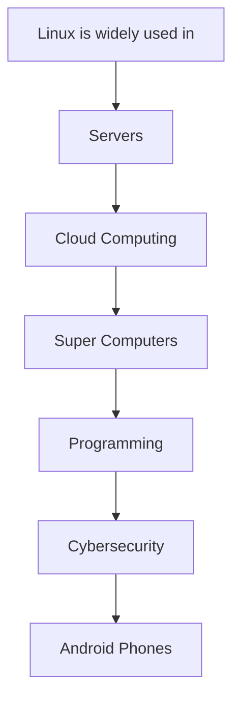

# Attack-Flow

 

## What it shows:
End-to-end attacker journey.

## Structure:

 

## Attack Flow Diagram

This diagram illustrates the full lifecycle of the simulated RDP attack, starting from reconnaissance and brute-force attempts to successful compromise, detection, and mitigation.
