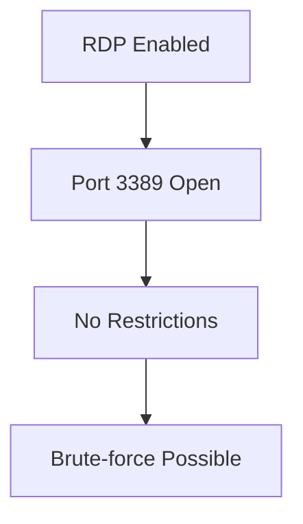
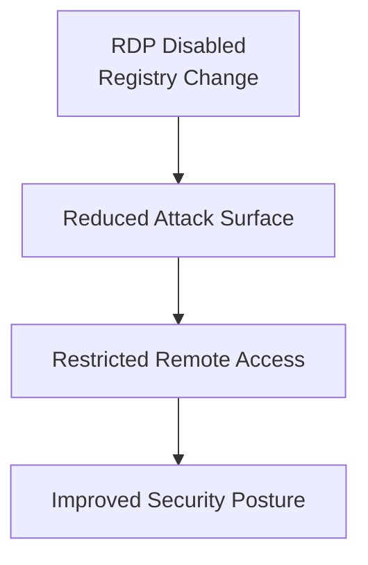

# Mitigation Architecture
 

## What it shows:
How security improved after disabling RDP.

  

## Structure:

## 1. LEFT — Before Mitigation ❌

  

## 2. RIGHT — After Mitigation ✅

  

## Mitigation Architecture

This diagram compares the system security posture before and after mitigation, highlighting how disabling RDP significantly reduced the attack surface.
