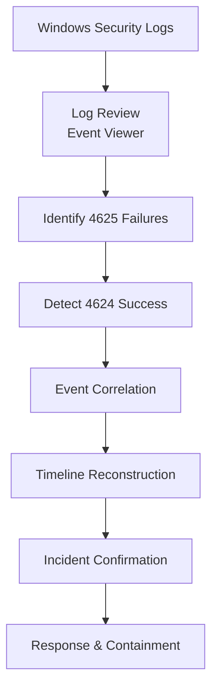

# SOC-Investigation-Flow

 

## What it shows:
How a SOC analyst detects an attack using log analysis.

  

## Structure:

 

## SOC Investigation Flow: 

This diagram represents how a Security Operations Center (SOC) analyst correlates authentication logs to detect brute-force activity and reconstruct an attack timeline.

