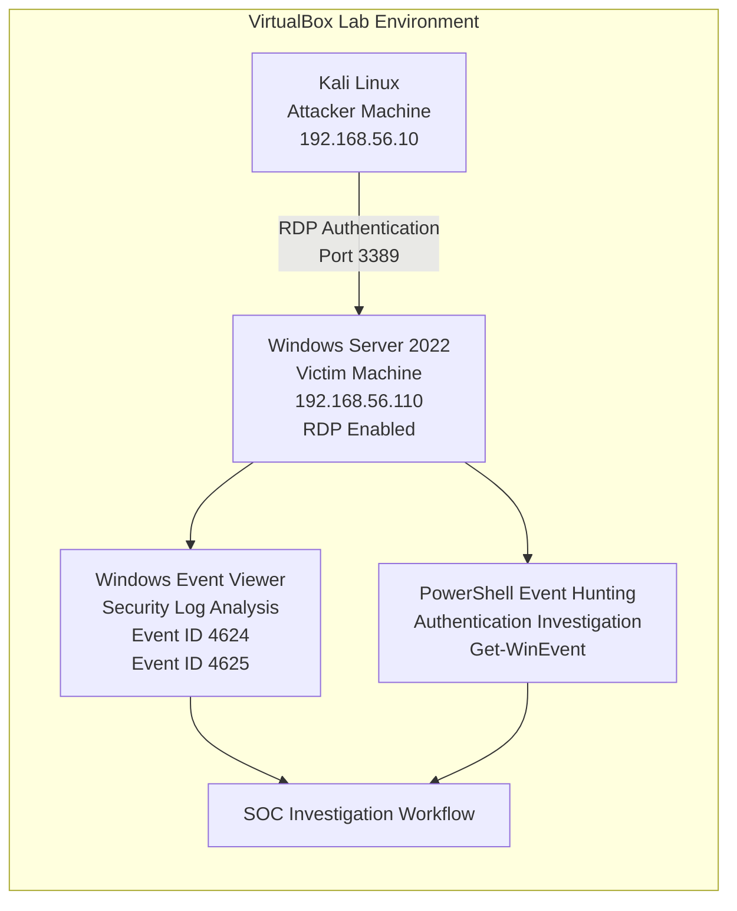

<h1 align="center">🛡️ Windows RDP Brute Force Detection & SIEM Investigation Lab</h1>

<h3 align="center">
RDP Authentication Monitoring, Windows Event Log Investigation & SOC Detection Workflow
</h3>

<p align="center">
  
  
  
  
  
  
  
  
</p>

<br>

# 📑 Table of Contents

- [Project Overview](#-project-overview)
- [Objectives](#-objectives)
- [Lab Architecture](#️-lab-architecture)
- [Architecture Diagram](#️-architecture-diagram)
- [Tools & Technologies Used](#️-tools--technologies-used)
- [Attack Simulation Workflow](#️-attack-simulation-workflow)
- [Windows Event Log Analysis](#-windows-event-log-analysis)
- [Detection & Investigation Findings](#-detection--investigation-findings)
- [Indicators of Compromise (IOCs)](#-indicators-of-compromise-iocs)
- [MITRE ATT&CK Mapping](#-mitre-attck-mapping)
- [PowerShell Log Hunting](#-powershell-log-hunting)
- [Incident Timeline](#-incident-timeline)
- [Mitigation Recommendations](#️-mitigation-recommendations)
- [Lessons Learned](#-lessons-learned)
- [Screenshots](#️-screenshots)
- [About the Analyst](#-about-the-analyst)

<br>

# 📌 Project Overview

This project simulates suspicious Remote Desktop Protocol (RDP) authentication activity against a Windows Server 2022 system to demonstrate how SOC analysts investigate Windows authentication logs and identify potential brute-force behavior.

The lab environment was built using VirtualBox with:

- Kali Linux acting as the attacker machine
- Windows Server 2022 acting as the victim machine

The project focuses on:

- Windows Security Event Log analysis
- RDP authentication monitoring
- Failed and successful logon investigation
- Event ID analysis
- PowerShell-based log hunting
- SOC investigation workflow
- MITRE ATT&CK mapping

During the simulation, multiple failed and successful RDP authentication attempts were generated and investigated using Windows Event Viewer and PowerShell.

<br>

# 🎯 Objectives

- Simulate RDP authentication activity in a controlled lab environment
- Analyze Windows Security Event Logs
- Investigate Event IDs related to authentication activity
- Understand how SOC analysts investigate suspicious login behavior
- Perform PowerShell-based log hunting
- Identify failed and successful RDP authentication attempts
- Correlate authentication events with source IP addresses
- Apply MITRE ATT&CK mapping to attack behavior
- Learn defensive monitoring concepts used in SOC environments

<br>

# 🏗️ Lab Architecture

## Environment Configuration

| Component | Description |
|-----------|-------------|
| Attacker Machine | Kali Linux |
| Victim Machine | Windows Server 2022 |
| Virtualization Platform | VirtualBox |
| Network Configuration | NAT + Host-Only Adapter |
| Monitoring Tool | Windows Event Viewer + Splunk Enterprise |
| Log Hunting Tool | PowerShell + Splunk SPL |
| SIEM | Splunk Enterprise (Host Machine) |
| Log Forwarding | Splunk Universal Forwarder + Sysmon |
| Targeted Protocol | RDP (Port 3389) |

<br>

## Lab Workflow

1. Configured Kali Linux and Windows Server 2022 in a virtual lab environment
2. Enabled Remote Desktop Protocol (RDP) on Windows Server
3. Created a dedicated RDP test user account
4. Verified network connectivity between both systems
5. Generated successful and failed RDP authentication attempts
6. Investigated Windows Security Event Logs
7. Performed PowerShell-based event hunting and authentication analysis

<br>

## 🖼️ Architecture Diagram



<br>

# 🛠️ Tools & Technologies Used

| Tool / Technology | Purpose |
|-------------------|---------|
| Kali Linux | Authentication testing |
| Windows Server 2022 | Target system |
| Windows Event Viewer | Security log analysis |
| PowerShell | Event hunting and filtering |
| VirtualBox | Virtual lab environment |
| RDP | Remote authentication protocol |

<br>

## Technical Skills Demonstrated

- Windows Event Log Analysis
- Authentication Monitoring
- RDP Security Investigation
- PowerShell Event Hunting
- Event ID Analysis
- Incident Investigation
- MITRE ATT&CK Mapping
- Threat Detection Concepts
- SOC Investigation Workflow

<br>

# ⚔️ Attack Simulation Workflow

## Step 1 — Environment Preparation

A controlled lab environment was created using VirtualBox with Kali Linux and Windows Server 2022.

<br>

## Step 2 — RDP Configuration

RDP was enabled on Windows Server 2022 and port 3389 availability was verified.

<br>

## Step 3 — User Account Configuration

A dedicated user account named `socuser` was created and added to the Remote Desktop Users group.

<br>

## Step 4 — Authentication Testing

Successful and failed RDP login attempts were generated from Kali Linux.

<br>

## Step 5 — Event Log Investigation

Windows Security Logs were analyzed using:

- Event Viewer
- PowerShell log hunting commands

<br>

## Step 6 — Detection Analysis

Authentication events were correlated using:

- Event IDs
- Source IP addresses
- Logon Types
- Authentication timestamps

<br>

# 📊 Windows Event Log Analysis

## Important Windows Event IDs

| Event ID | Description |
|----------|-------------|
| 4625 | Failed Login Attempt |
| 4624 | Successful Login |
| 4776 | NTLM Authentication |
| 4672 | Special Privileges Assigned |

<br>

## Event ID 4625 — Failed Authentication

Event ID 4625 was generated during failed RDP authentication attempts.

The investigation identified:

- Invalid password attempts
- Source IP address
- Failed authentication patterns
- NTLM authentication activity
- Remote login behavior

<br>

## Event ID 4624 — Successful Authentication

Event ID 4624 was generated after successful RDP authentication.

The logs confirmed:

- Successful remote login activity
- User session creation
- RDP authentication success
- Logon Type 10 activity
- Source system identification

<br>

# 🔍 Detection & Investigation Findings

The investigation revealed repeated failed authentication attempts originating from the Kali Linux system targeting the Windows Server 2022 machine over RDP.

Key findings included:

- Multiple failed RDP login attempts
- Event ID 4625 authentication failures
- Successful Event ID 4624 RDP logins
- NTLM authentication activity
- Logon Type 10 associated with RDP access
- Source IP correlation with attacker system

This workflow demonstrates how SOC analysts investigate suspicious authentication activity and identify potential brute-force behavior within Windows environments.

<br>

# 🚨 Indicators of Compromise (IOCs)

| IOC Type | Observed Value |
|----------|----------------|
| Source IP Address | 192.168.56.10 |
| Target System | Windows Server 2022 |
| Attack Method | RDP Authentication Attempts |
| Failed Log Event | Event ID 4625 |
| Successful Log Event | Event ID 4624 |
| Authentication Protocol | NTLM |
| Target User Account | socuser |

<br>

# 🧠 MITRE ATT&CK Mapping

| Technique | MITRE ATT&CK ID | Description |
|-----------|-----------------|-------------|
| Brute Force | T1110 | Repeated authentication attempts |
| Remote Services | T1021.001 | Remote Desktop Protocol abuse |
| Valid Accounts | T1078 | Use of legitimate credentials |

<br>

## MITRE Analysis

The observed behavior aligns with authentication attack techniques commonly associated with brute-force activity targeting exposed RDP services.

The project demonstrates how Windows authentication logs can help SOC analysts identify suspicious remote access behavior.

<br>

# 💻 PowerShell Log Hunting

## Failed Authentication Events — Event ID 4625

```powershell
Get-WinEvent -LogName Security | Where-Object {$_.Id -eq 4625}
```

<br>

## Successful Authentication Events — Event ID 4624

```powershell
Get-WinEvent -LogName Security | Where-Object {$_.Id -eq 4624}
```

<br>

## PowerShell Investigation Purpose

These commands were used to:

- Filter Windows authentication events
- Investigate failed logon attempts
- Identify successful RDP authentication activity
- Perform manual event hunting
- Understand Windows Security Log behavior

<br>

# 🕒 Incident Timeline

| Time | Activity |
|------|-----------|
| 10:01 | Kali Linux attacker machine initialized |
| 10:02 | Network connectivity verification performed |
| 10:03 | RDP configuration validated |
| 10:04 | Failed authentication attempts generated |
| 10:05 | Event ID 4625 logs recorded |
| 10:06 | Successful RDP authentication performed |
| 10:07 | Event ID 4624 logs recorded |
| 10:08 | Windows Event Log investigation performed |
| 10:10 | PowerShell log hunting executed |
| 10:12 | Authentication analysis completed |

<br>

# 🛡️ Mitigation Recommendations

- Enable Multi-Factor Authentication (MFA)
- Restrict RDP access using VPNs
- Implement account lockout policies
- Enforce strong password policies
- Disable unnecessary remote access exposure
- Monitor Windows Security Logs regularly
- Apply firewall restrictions for RDP services
- Enable centralized logging solutions
- Perform continuous authentication monitoring

<br>

# 📚 Lessons Learned

- Importance of Windows authentication monitoring
- Risks associated with exposed RDP services
- Importance of Event ID analysis during investigations
- Value of PowerShell-based log hunting
- Understanding Logon Type 10 for RDP activity
- Importance of correlating failed and successful authentication events
- Benefits of proactive security monitoring

<br>

## Project Outcome

This project provided hands-on experience with:

- Windows Event Log investigation
- Authentication monitoring
- PowerShell event hunting
- RDP security analysis
- Incident investigation workflow
- SOC detection concepts
- Authentication event correlation

<br>

# 🖼️ Screenshots

The following screenshots document the complete SOC investigation workflow performed during this project.

| Screenshot | Description |
|------------|-------------|
| [01-lab-setup.png](Screenshots/01-lab-setup.png) | VirtualBox lab environment setup |
| [02-kali-to-windows-connectivity.jpg](Screenshots/02-kali-to-windows-connectivity.jpg) | Connectivity verification from Kali Linux |
| [03-windows-to-kali-connectivity.jpg](Screenshots/03-windows-to-kali-connectivity.jpg) | Connectivity verification from Windows Server |
| [04-rdp-enabled-configuration.jpg](Screenshots/04-rdp-enabled-configuration.jpg) | RDP enabled on Windows Server 2022 |
| [05-rdp-port-verification.jpg](Screenshots/05-rdp-port-verification.jpg) | Verification of RDP port 3389 |
| [06-test-user-account-creation.jpg](Screenshots/06-test-user-account-creation.jpg) | Creation of SOC test user |
| [07-test-user-account-created.jpg](Screenshots/07-test-user-account-created.jpg) | Verification of created user account |
| [08-add-user-to-remote-desktop-users-group.jpg](Screenshots/08-add-user-to-remote-desktop-users-group.jpg) | Adding user to Remote Desktop Users group |
| [09-rdp-user-group-assignment.jpg](Screenshots/09-rdp-user-group-assignment.jpg) | Verification of RDP group assignment |
| [10-rdp-successful-authentication-command.png](Screenshots/10-rdp-successful-authentication-command.png) | Successful RDP authentication command |
| [11-successful-rdp-login-from-kali-to-windows-server.jpg](Screenshots/11-successful-rdp-login-from-kali-to-windows-server.jpg) | Successful RDP session |
| [12-rdp-failed-login-attempts-from-kali.png](Screenshots/12-rdp-failed-login-attempts-from-kali.png) | Failed RDP authentication attempts |
| [13-eventid-4625-failed-rdp-logon-analysis.jpg](Screenshots/13-eventid-4625-failed-rdp-logon-analysis.jpg) | Event ID 4625 investigation |
| [14-failed-rdp-authentication-event-4625.jpg](Screenshots/14-failed-rdp-authentication-event-4625.jpg) | Failed authentication log analysis |
| [15-successful-rdp-authentication-event-4624-logon-type.jpg](Screenshots/15-successful-rdp-authentication-event-4624-logon-type.jpg) | Event ID 4624 analysis |
| [16-security-log-authentication-analysis-overview.jpg](Screenshots/16-security-log-authentication-analysis-overview.jpg) | Windows Security Log investigation |
| [17-eventid-4625-failed-logon-powershell-query.jpg](Screenshots/17-eventid-4625-failed-logon-powershell-query.jpg) | PowerShell query for failed logons |
| [18-eventid-4624-successful-logon-powershell-query.jpg](Screenshots/18-eventid-4624-successful-logon-powershell-query.jpg) | PowerShell query for successful logons |


<br>

# 📌 Investigation Evidence Summary

The screenshots above provide documented evidence of:

- RDP environment configuration
- Network connectivity validation
- Authentication testing workflow
- Successful and failed RDP login attempts
- Windows Security Event Log investigation
- Event ID 4624 and 4625 analysis
- PowerShell-based authentication hunting
- SOC investigation and detection workflow

<br>

# 👩‍💻 About the Analyst

## Priyanka Rane

SOC Analyst L1 | Threat Detection & Incident Response

📧 ranepriyanka567@gmail.com

🔗 LinkedIn: https://www.linkedin.com/in/priyanka-rane-606a71257/

<br>

⭐ If you found this project useful, feel free to star the repository.
