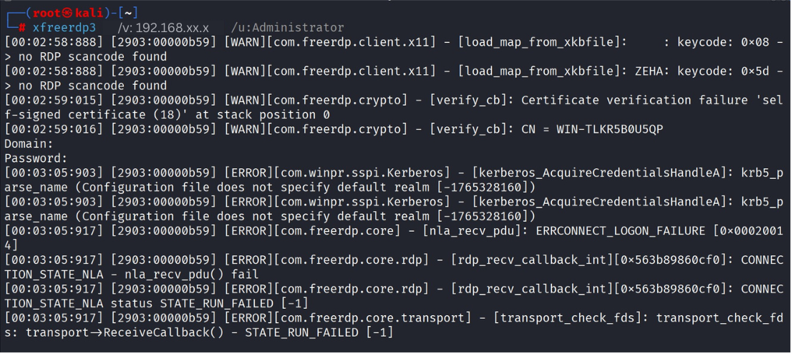
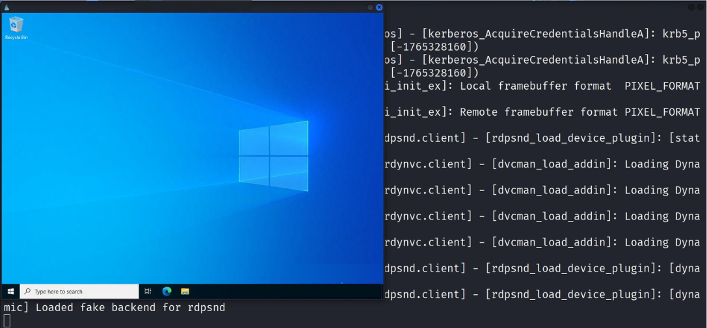

# 🧨 Attack Phase

Shows attacker activity and authentication attempts from the Kali Linux machine.

Includes:
- RDP connection attempts
- Brute-force simulation
- Initial access validation

  

  

## Kali RDP Command

 
### Evidence of multiple failed RDP authentication attempts from the attacker machine, indicating a brute-force attack in progress.

  

## Successful RDP Login

 
### Successful RDP Session extablished after repeated login attempts, confirming initial system compromise.
