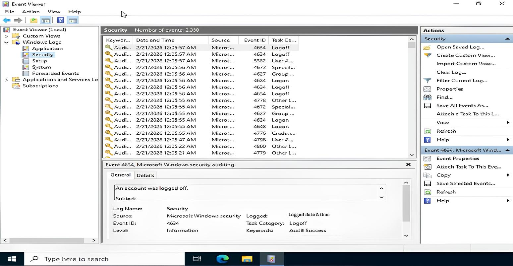
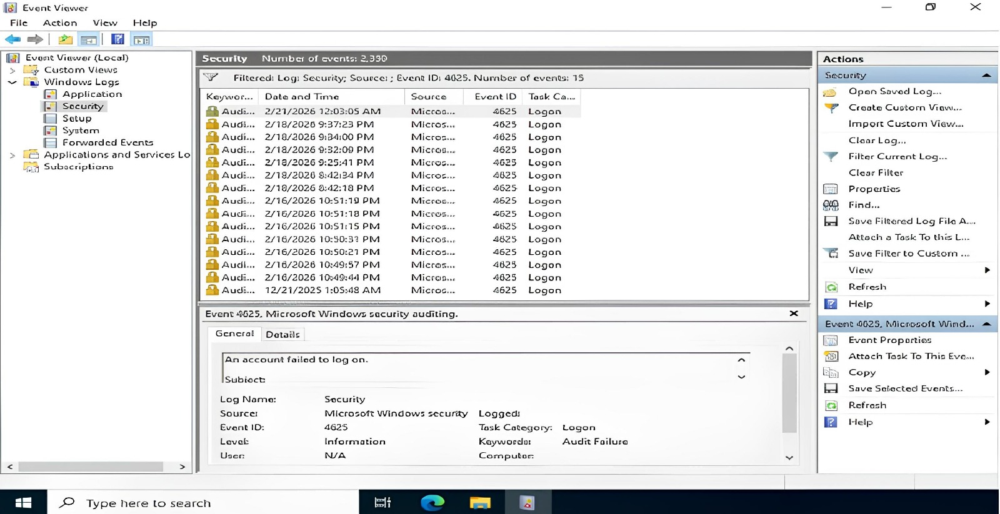
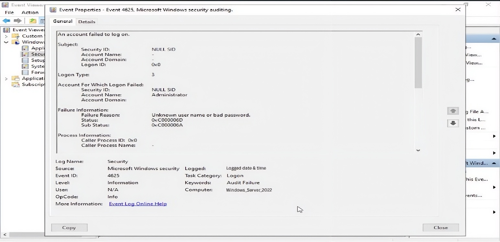
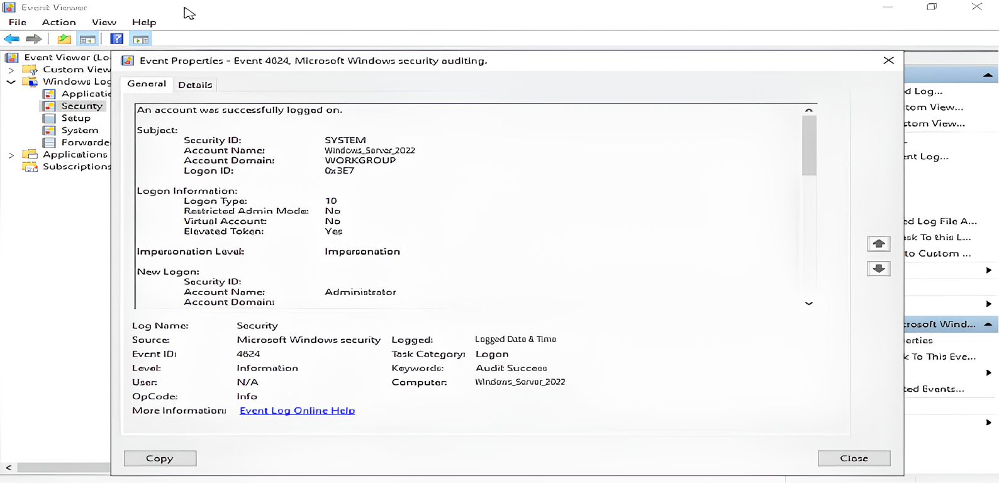

## 🔍 Detection Phase

Highlights how the attack was detected using Windows Security Logs.

Includes:
- Event Viewer logs
- Event ID 4625 (Failed Logons)
- Event ID 4624 (Successful Logon)
- Log correlation indicators

  

 
### Windows Event Viewer navigation showing access to Security logs for authentication monitoring

  

 
### Multiple Event ID 4625 entries observed, highlighting repeated failed login attempts typical of brute-force activity

  

 
### Detailed view of Event ID 4625 showing failed authentication attempts and associated logon metadata

  

 
### Event ID 4624 confirming successful logon, correlated with prior brute-force attempts
